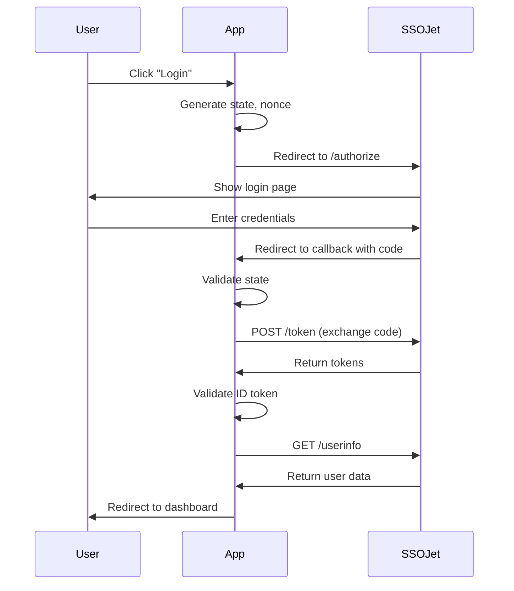
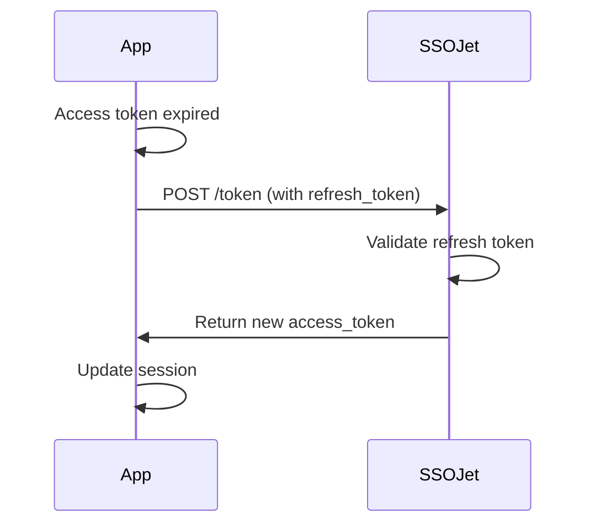

# OIDC Concepts

This guide provides an overview of OpenID Connect (OIDC) concepts relevant to integrating authentication in your React applications.

## 🎯 What is OIDC?

**OpenID Connect (OIDC)** is an identity layer built on top of OAuth 2.0. It allows clients to verify the identity of users and obtain basic profile information in an interoperable and REST-like manner.

### OIDC vs OAuth 2.0

| Feature | OAuth 2.0 | OIDC |
|---------|-----------|------|
| **Purpose** | Authorization | Authentication + Authorization |
| **Primary Use** | API access delegation | User identity verification |
| **Returns** | Access tokens | ID tokens + Access tokens |
| **User Info** | Not standardized | Standardized (UserInfo endpoint) |

**In simple terms:**
- **OAuth 2.0**: "Can this app access my photos?"
- **OIDC**: "Who is this user, and can this app access their photos?"

## 🔑 Key Concepts

### 1. Tokens

OIDC uses three types of tokens:

#### ID Token (JWT)
- Contains user identity information
- Cryptographically signed by the identity provider
- Can be decoded and verified by your application
- Example claims: `sub` (user ID), `email`, `name`

**Structure:**
```
eyJhbGciOiJSUzI1NiIsInR5cCI6IkpXVCJ9.  # Header
eyJzdWIiOiIxMjM0NTY3ODkwIiwibmFtZSI6... # Payload
SflKxwRJSMeKKF2QT4fwpMeJf36POk6yJV_adQssw5c # Signature
```

**Decoded Payload:**
```json
{
  "sub": "user_123",
  "email": "user@example.com",
  "name": "John Doe",
  "iss": "https://api.ssojet.com/oidc",
  "aud": "your_client_id",
  "exp": 1735990000,
  "iat": 1735986400
}
```

#### Access Token
- Used to access protected resources (APIs)
- Opaque or JWT format
- Short-lived (typically 1 hour)
- Passed in `Authorization: Bearer <token>` header

#### Refresh Token
- Used to obtain new access tokens
- Long-lived (days to weeks)
- Must be stored securely
- Can be revoked

### 2. Flows (Grant Types)

OIDC defines several authentication flows:

#### Authorization Code Flow
**Best for:** Server-side web apps (Next.js, Remix)

**Flow:**
1. User clicks "Login"
2. Redirect to SSOJet authorization endpoint
3. User authenticates
4. SSOJet redirects back with **authorization code**
5. Backend exchanges code for tokens
6. Tokens stored securely on server

**Security:** ✅ High (client secret used on server)

#### Authorization Code Flow with PKCE
**Best for:** Single Page Applications, Mobile Apps

**PKCE (Proof Key for Code Exchange)** adds security without requiring a client secret.

**Flow:**
1. Generate random `code_verifier` and `code_challenge`
2. Redirect to authorization endpoint with `code_challenge`
3. User authenticates
4. Receive authorization code
5. Exchange code + `code_verifier` for tokens

**Security:** ✅ High (no client secret exposed)

#### Implicit Flow (Deprecated)
**Status:** ⚠️ Not recommended

Tokens returned directly in URL fragment. Vulnerable to token leakage.

### 3. Endpoints

OIDC providers expose standard endpoints:

#### Authorization Endpoint
```
https://api.ssojet.com/oidc/authorize
```
- Initiates authentication
- User logs in here
- Returns authorization code

**Parameters:**
- `client_id`: Your application's ID
- `redirect_uri`: Where to send the user after authentication
- `response_type`: `code` (for authorization code flow)
- `scope`: `openid profile email`
- `state`: Random value for CSRF protection
- `login_hint`: Pre-fill email (optional)

#### Token Endpoint
```
https://api.ssojet.com/oidc/token
```
- Exchanges authorization code for tokens
- Refreshes access tokens
- Server-to-server communication

**Request:**
```http
POST /oidc/token HTTP/1.1
Host: api.ssojet.com
Content-Type: application/x-www-form-urlencoded

grant_type=authorization_code&
code=AUTH_CODE_HERE&
redirect_uri=https://yourapp.com/callback&
client_id=YOUR_CLIENT_ID&
client_secret=YOUR_CLIENT_SECRET
```

**Response:**
```json
{
  "access_token": "eyJhbGc...",
  "id_token": "eyJhbGc...",
  "refresh_token": "ref_...",
  "token_type": "Bearer",
  "expires_in": 3600
}
```

#### UserInfo Endpoint
```
https://api.ssojet.com/oidc/userinfo
```
- Returns user profile information
- Requires valid access token

**Request:**
```http
GET /oidc/userinfo HTTP/1.1
Host: api.ssojet.com
Authorization: Bearer ACCESS_TOKEN_HERE
```

**Response:**
```json
{
  "sub": "user_123",
  "email": "user@example.com",
  "email_verified": true,
  "name": "John Doe",
  "picture": "https://avatar.url/image.jpg"
}
```

#### Discovery Endpoint
```
https://api.ssojet.com/oidc/.well-known/openid-configuration
```
- Lists all OIDC endpoints and capabilities
- Used by OIDC libraries for auto-configuration

### 4. Scopes

Scopes define what information you're requesting:

| Scope | Description | Claims Returned |
|-------|-------------|-----------------|
| `openid` | **Required** - Indicates OIDC request | `sub` |
| `profile` | User's profile information | `name`, `picture`, `updated_at` |
| `email` | User's email address | `email`, `email_verified` |
| `address` | User's postal address | `address` |
| `phone` | User's phone number | `phone_number`, `phone_number_verified` |

**Example:**
```javascript
scope: "openid profile email"
```

### 5. Claims

Claims are pieces of information about the user:

#### Standard Claims

| Claim | Description | Example |
|-------|-------------|---------|
| `sub` | Subject (unique user identifier) | `user_123` |
| `name` | Full name | `John Doe` |
| `given_name` | First name | `John` |
| `family_name` | Last name | `Doe` |
| `email` | Email address | `john@example.com` |
| `email_verified` | Email verification status | `true` |
| `picture` | Profile picture URL | `https://...` |
| `iss` | Issuer (who issued the token) | `https://api.ssojet.com/oidc` |
| `aud` | Audience (who the token is for) | `your_client_id` |
| `exp` | Expiration time (Unix timestamp) | `1735990000` |
| `iat` | Issued at time | `1735986400` |

#### Custom Claims

SSOJet may include custom claims:
- `organization`: User's organization
- `roles`: User's roles/permissions
- `groups`: User's groups

## 🔒 Security Concepts

### 1. State Parameter

Prevents CSRF (Cross-Site Request Forgery) attacks:

```javascript
// Generate random state
const state = crypto.randomBytes(32).toString('hex')

// Store in session
session.oauthState = state

// Include in authorization request
const authUrl = `${issuer}/authorize?...&state=${state}`

// Validate on callback
if (req.query.state !== session.oauthState) {
  throw new Error('Invalid state parameter')
}
```

### 2. Nonce

Prevents replay attacks on ID tokens:

```javascript
const nonce = crypto.randomBytes(16).toString('hex')

// Include in authorization request
const authUrl = `${issuer}/authorize?...&nonce=${nonce}`

// Verify in ID token
const decoded = jwt.decode(idToken)
if (decoded.nonce !== nonce) {
  throw new Error('Invalid nonce')
}
```

### 3. PKCE (Proof Key for Code Exchange)

Protects authorization code from interception:

```javascript
// 1. Generate code verifier
const codeVerifier = crypto.randomBytes(32).toString('base64url')

// 2. Generate code challenge
const codeChallenge = crypto
  .createHash('sha256')
  .update(codeVerifier)
  .digest('base64url')

// 3. Send challenge in authorization request
const authUrl = `${issuer}/authorize?...&code_challenge=${codeChallenge}&code_challenge_method=S256`

// 4. Send verifier in token request
const tokenResponse = await fetch(tokenEndpoint, {
  body: new URLSearchParams({
    code: authCode,
    code_verifier: codeVerifier,
    ...
  })
})
```

### 4. Token Validation

Always validate ID tokens:

```javascript
import jwt from 'jsonwebtoken'
import jwksClient from 'jwks-rsa'

const client = jwksClient({
  jwksUri: 'https://api.ssojet.com/oidc/.well-known/jwks.json'
})

function getKey(header, callback) {
  client.getSigningKey(header.kid, (err, key) => {
    callback(null, key.getPublicKey())
  })
}

jwt.verify(idToken, getKey, {
  audience: 'your_client_id',
  issuer: 'https://api.ssojet.com/oidc',
  algorithms: ['RS256']
}, (err, decoded) => {
  if (err) {
    console.error('Token validation failed:', err)
  } else {
    console.log('User:', decoded)
  }
})
```

## 🎨 Common Patterns

### 1. Login Hint

Pre-fill the user's email:

```javascript
const authUrl = `${issuer}/authorize?...&login_hint=user@example.com`
```

### 2. Silent Authentication

Check if user is logged in without showing UI:

```javascript
const authUrl = `${issuer}/authorize?...&prompt=none`
```

**Responses:**
- If logged in: Returns authorization code
- If not logged in: Returns `login_required` error

### 3. Forced Reauthentication

Force user to re-enter credentials:

```javascript
const authUrl = `${issuer}/authorize?...&prompt=login`
```

### 4. Consent Screen

Request user consent:

```javascript
const authUrl = `${issuer}/authorize?...&prompt=consent`
```

## 📚 OIDC Flow Examples

### Complete Authorization Code Flow



### Token Refresh Flow



## 🛠️ Best Practices

### 1. Token Storage

| Environment | Storage | Security |
|-------------|---------|----------|
| **Server-side** | Encrypted session, Database | ✅ Secure |
| **SPA (tokens)** | Memory only | ✅ Secure (lost on refresh) |
| **SPA (refresh token)** | HttpOnly cookie | ✅ Secure |
| **LocalStorage** | ❌ Avoid | ⚠️ Vulnerable to XSS |
| **SessionStorage** | ⚠️ Use with caution | ⚠️ Better than localStorage |

### 2. Token Lifetime

- **ID Token**: Short (1 hour)
- **Access Token**: Short (1 hour)
- **Refresh Token**: Long (days/weeks) with rotation

### 3. Logout

Implement proper logout:

```javascript
// 1. Clear local session
sessionStorage.clear()
localStorage.clear()

// 2. Revoke tokens (optional)
await fetch(`${issuer}/revoke`, {
  method: 'POST',
  body: new URLSearchParams({
    token: refreshToken,
    client_id: clientId,
  })
})

// 3. Redirect to SSOJet logout
window.location.href = `${issuer}/logout?` +
  `post_logout_redirect_uri=${encodeURIComponent(window.location.origin)}`
```

## 📖 Further Reading

### Official Specifications
- [OpenID Connect Core 1.0](https://openid.net/specs/openid-connect-core-1_0.html)
- [OAuth 2.0 RFC 6749](https://tools.ietf.org/html/rfc6749)
- [OAuth 2.0 for Browser-Based Apps](https://datatracker.ietf.org/doc/html/draft-ietf-oauth-browser-based-apps)

### SSOJet Resources
- [SSOJet OIDC Documentation](https://docs.ssojet.com/api-reference/oidc/)
- [SSOJet Dashboard](https://portal.ssojet.com)

### Tools
- [jwt.io](https://jwt.io) - Decode JWT tokens
- [OIDC Playground](https://ssojet.com/oidc-playground/) - Test OIDC flows

---

<p align="center">
  Made with ❤️ by the <a href="https://ssojet.com">SSOJet</a> team
</p>
